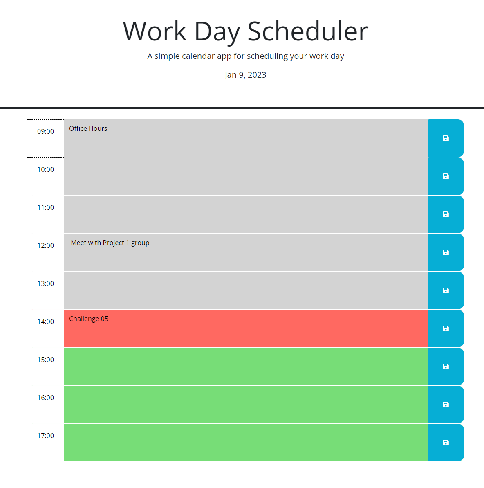

=============================
# 05-work-day-scheduler
-----------
A simple calendar application that allows a user to save events for each hour of the day.

-   What was your motivation?
I wanted to make get this scheduler to a working condition.  

-   Why did you build this project?
To gain more experience with using JQuery, click events, local storage, and APIs.

-   What problem does it solve? 
As an application it provides the user with a simple 8 hour schedule that they can edit and save.

-   What did you learn? 
I learned how to walk the DOM tree in order to find specific items that I need to attribute in JQuery. I also learned more about basic conditional statements and when I need to use them. I learned how to effectively pull from DayJS and use the time data to use in JavaScript.

Table of Contents
----------------------------

-   [Installation](#installation)
-   [Usage](#usage)
-   [Credits](#credits)
-   [License](#license)

Installation
------------

No installation necessary.

Follow the link below to access the web application:
https://wabarringer.github.io/05-work-day-scheduler/

Usage
-----

On page load there will be a blank 8 hour schedule from 9AM - 5PM. 

Past hour blocks will have a grey background. Future hour blocks will be green. The present hour block will be red. 

You can type tasks into the hour block that you wish to schedule them to, and they will be saved to the browser's local storage so that on reload you won't lose your tasks.

    

Credits
-------

N/A

License
-------

N/A